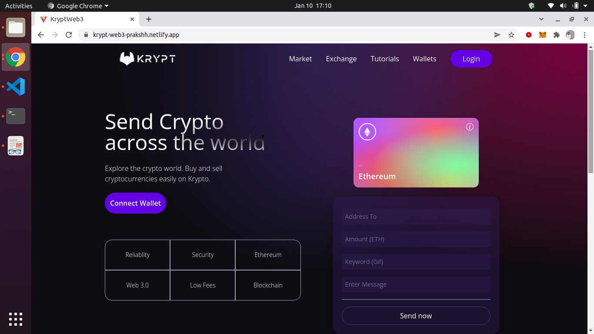
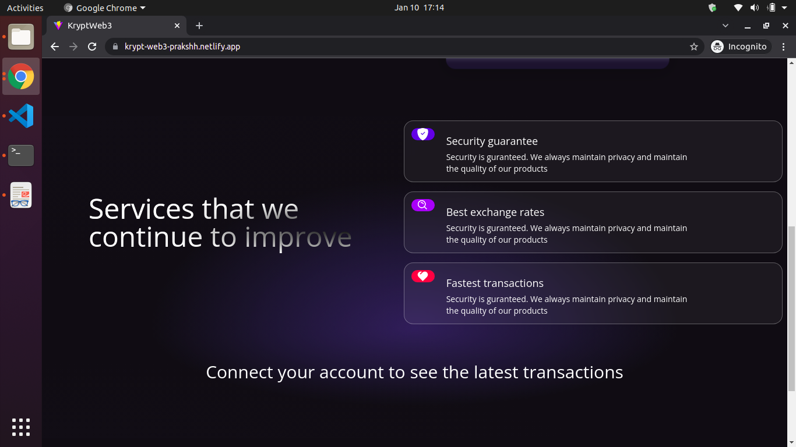
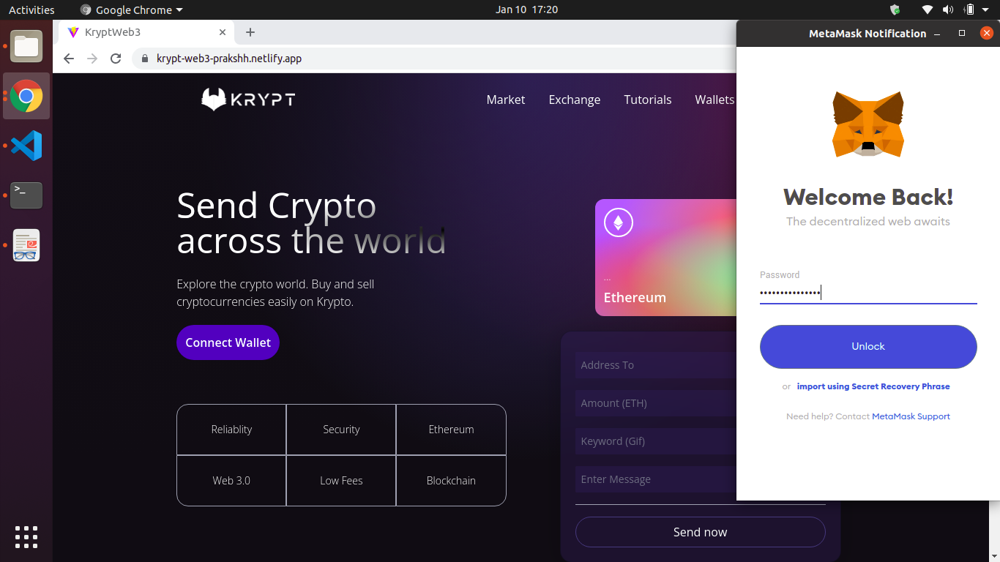
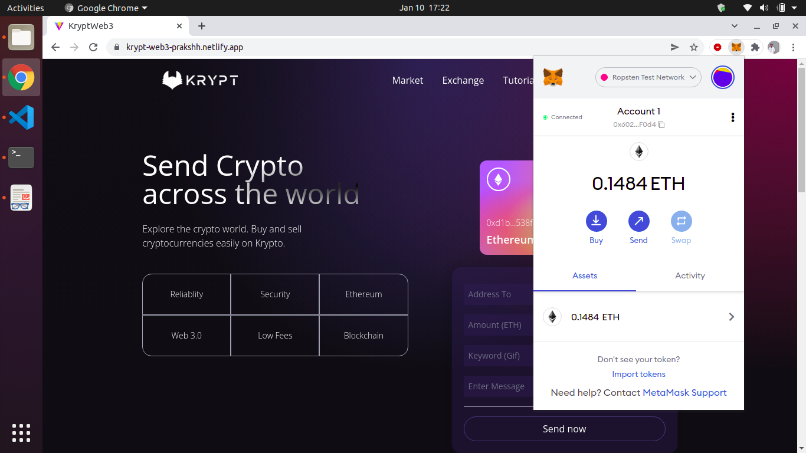
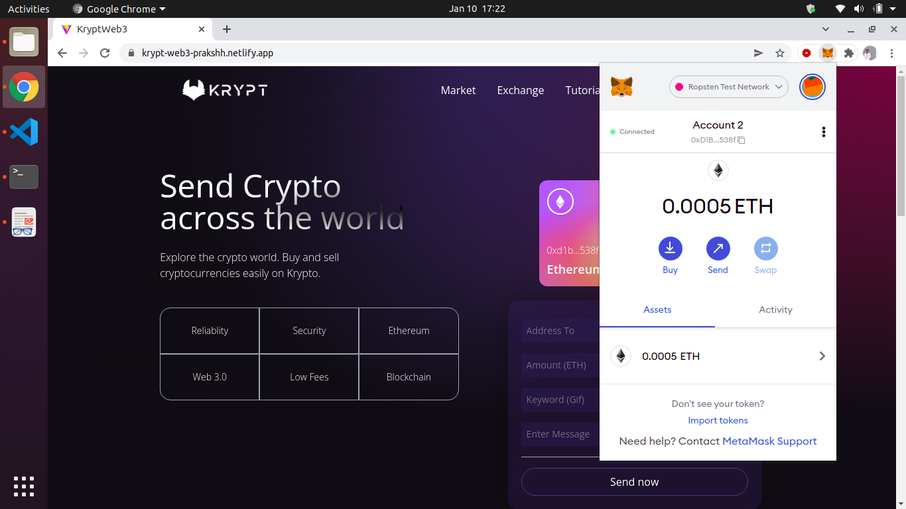
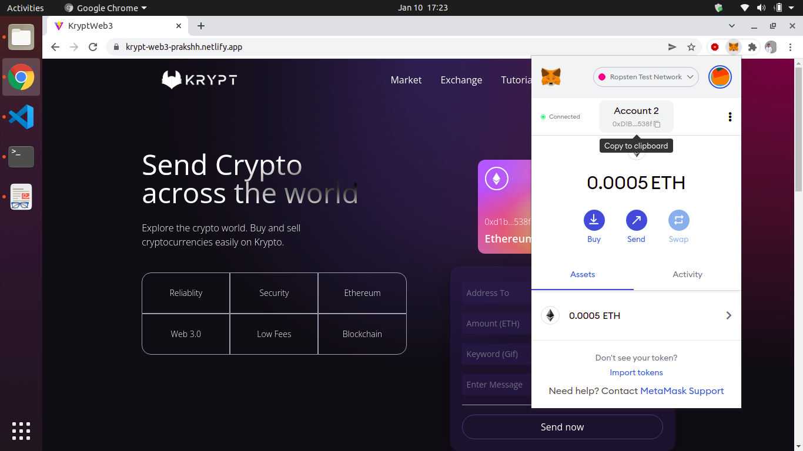
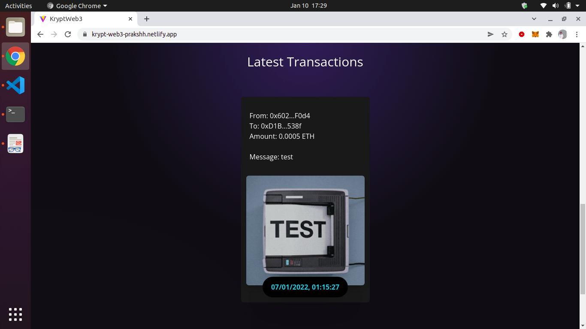
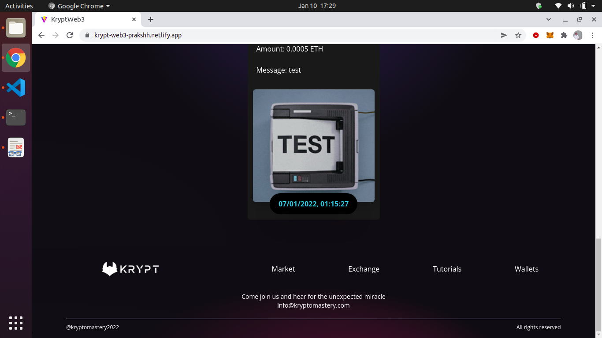

# Krypt - Modern Web 3.0 Blockchain Application

<h1><a href="https://krypt-web3-prakshh.netlify.app/">LIVE SITE</a></h1>

## Introduction
This is a code repository of Modern Web 3.0 Blockchain Application using React, Solidity and Smart Contracts.

Krypt is the #Web3 #Blockchain app with a stunning design, connected to the blockchain, metamask pairing, interaction with smart contracts, sending Ethereum through the blockchain network, writing solidity code, and much more.

## Stay up to date with new projects
New major projects coming soon. To stay up to date, keep checking : https://prakshh.github.io/